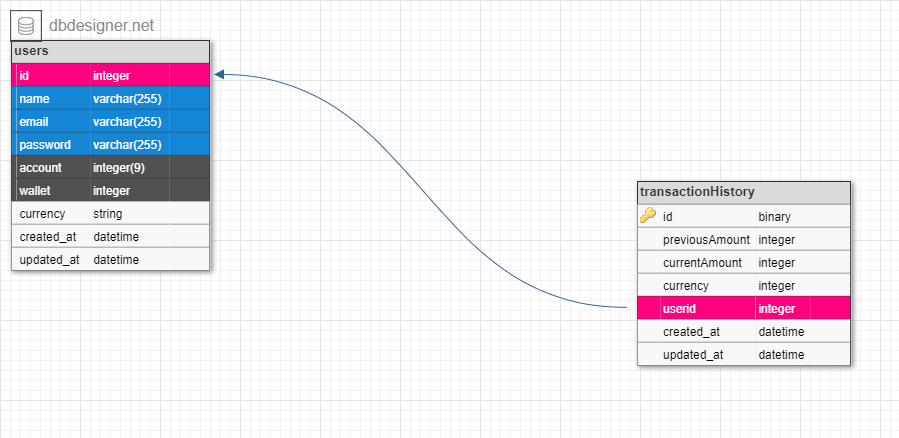

# Demo-Credit
# About

This Project is an Application Programming Interface for a mobile lending app that requires wallet functionality . This include routes for User  can create an account, can fund their account, can transfer funds to another user’s account, and can withdraw funds from their account. The Purpose of this Project is to aid users functionality for wallet service.

# Content

- Installation
- Documentation
- Deployment
- Features
- Built-With
- Acknowledgement

# Installation
- Visit the github respository [github respository link](https://github.com/Beloved1310/Demo-Credit)
- Clone the application programming interface to your Desktop from github.

  > navigate to the **_code_** button on the repository.

  > copy the link and clone using the command _git clone repository url_

  > or using github desktop

  > or download to your local desktop.

- Open the code using any code editor.

- On terminal

```
$ npm install
```

- Provide the environment variables as specify in the `config.js` file
# Documentation

The Project is well documented on Postman. The Publication link is [Demo-Credit Postman link](https://documenter.getpostman.com/view/15034996/2s8Yt1spxw)

# Deployment

The Project live deployment is [deployment link](https://adefisayo-adejumo-lendsqr-be-test.vercel.app). Use the documentation to know the routes for easy navigation.

# Features
 ### Schema Illustration

The image above shows the table Schema in KnexJs Js, The user `id ` is unique and incremented with a reference when saving a transaction history for wallet functionality in the transaction history `userid` field. 

For the  User Creation **POST**  request - the fields 
   > name
   > email
   > password

For the wallet transfer, fund and withdrawal - the fields
   > amount
   > wallet

### Schema SQL QUERY 

```
CREATE TABLE `users` (
	`id` INT NOT NULL AUTO_INCREMENT,
	`name` varchar(255) NOT NULL,
	`email` varchar(255) NOT NULL,
	`password` varchar(255) NOT NULL,
	`account` INT(9) NOT NULL,
	`wallet` INT NOT NULL,
	`currency` VARCHAR(255) NOT NULL,
	`created_at` DATETIME NOT NULL,
	`updated_at` DATETIME NOT NULL
);

CREATE TABLE `transactionHistory` (
	`id` BINARY NOT NULL AUTO_INCREMENT,
	`previousAmount` INT NOT NULL,
	`currentAmount` INT NOT NULL,
	`currency` INT NOT NULL,
	`userid` INT NOT NULL,
	`created_at` DATETIME NOT NULL,
	`updated_at` DATETIME NOT NULL,
	PRIMARY KEY (`id`)
);

ALTER TABLE `transactionHistory` ADD CONSTRAINT `transactionHistory_fk0` FOREIGN KEY (`userid`) REFERENCES `users`(`id`);

```
# Built-With

The Api is built with Node.js, Json WebToken, Knex.js ORM and MySQL database to store information into the database. In addition, Json WEb Token to sign user information to accesss wallet functionality. The Application Environment Variable to implement funtionality while building the project are:


- Environment Variable Names
  - DB_HOST : to connect to  mysql url connection
  - DB_HOST : to connect to my sql host connection
  - DB_HOST : to connect to mysql  user connection
  - DB_PASSWORD : to connect to mysql  password connection
  - DB_PORT : to connect to mysql  port connection
  - DB_NAME : to connect to mysql  name connection
  - NODE_ENV : to specify the environment node connection is
  - JWT : to authenticate users
  - debug : to asychronously log statement
# Additions

This service can be intergrated in a lending application and the application can be scaled to include other funtionality